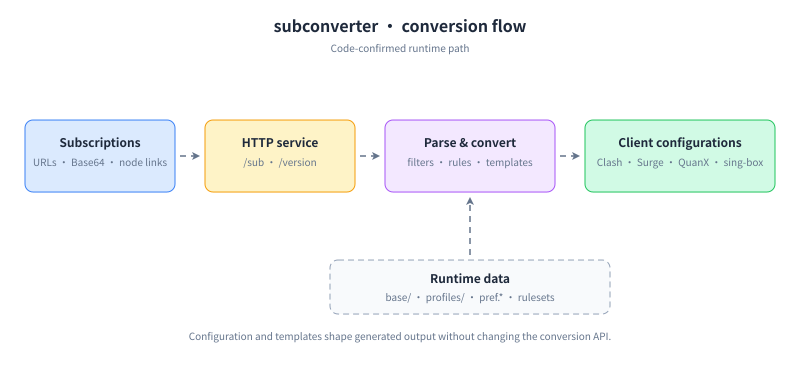

# subconverter

将代理订阅与单节点链接转换为客户端可用配置。项目提供轻量 HTTP 服务、C++20 转换内核、可复用基础模板，以及 Linux、macOS、Windows 和 Docker 的发布构建。

[English README](README.md) · [Docker 使用说明](README-docker.md) · [许可证](LICENSE)



## 功能

- 获取订阅 URL、读取本地配置，并识别 Base64 或纯文本订阅内容。
- 解析 SS/SSR、VMess、Trojan、VLESS、Clash、Surge、Quantumult 等常用节点与配置格式。
- 输出 Clash/ClashR、Surge、Quantumult/Quantumult X、Loon、Surfboard、Mellow、sing-box 及简易订阅格式。
- 使用 `base/` 中的规则、策略组、重命名、Emoji、过滤器、模板和 Profile 处理结果。

## 快速开始

服务默认监听 `25500`。建议先复制示例偏好文件，再保存本地设置：

```bash
cp base/pref.example.ini base/pref.ini
./subconverter -f "$(pwd)/base/pref.ini"
```

确认服务可用：

```bash
curl http://127.0.0.1:25500/version
```

将源订阅 URL 整体 URL 编码后，使用 `/sub` 转换为 Clash：

```text
http://127.0.0.1:25500/sub?target=clash&url=https%3A%2F%2Fexample.com%2Fsubscription
```

对 VLESS/VMess 输出，`udp=true` 会生成 `udp: true`，并默认使用 `packet-encoding: xudp`；可通过 `xudp=true` 或 `xudp=false` 单独覆盖编码行为。

## 目标格式与输入

| 类别 | 支持值 |
| --- | --- |
| 主要目标 | `clash`、`clashr`、`surge`、`quan`、`quanx`、`loon`、`surfboard`、`mellow`、`singbox` |
| 简易目标 | `ss`、`ssr`、`ssd`、`sssub`、`v2ray`、`trojan`、`mixed` |
| 输入形式 | HTTP(S) URL、本地文件、Base64 订阅、纯文本节点链接 |

多个输入 URL 使用 `|` 连接后，再整体 URL 编码。远程纯文本订阅可每行返回一个节点链接，并保留 `#备注`。

## 配置与安全

`base/` 是运行时数据目录：

- `pref.example.ini`、`pref.example.yml`、`pref.example.toml` 说明服务与节点偏好。
- `config/`、`profiles/`、`rules/`、`snippets/`、`base/` 分别存放外部配置、Profile、规则集、片段和输出模板。
- `generate.ini` 定义 `subconverter -g` 与 `--artifact <name>` 的文件生成任务。

订阅地址、API Token 和 Gist 凭据均属于敏感信息。请放在未跟踪的偏好文件或环境配置中，不要提交到 `base/`。

## 构建与运行

项目需要 CMake、C++20 编译器、libcurl、yaml-cpp、PCRE2、RapidJSON、toml11、QuickJS 和 libcron：

```bash
cmake -S . -B build -DCMAKE_BUILD_TYPE=Release
cmake --build build --parallel
```

`scripts/` 中的发布脚本会准备依赖并打包运行时 `base/` 目录。可使用 `scripts/build.alpine.release.sh`、`scripts/build.macos.release.sh` 或 `scripts/build.windows.release.sh` 复现 CI 打包流程。容器运行和自定义镜像请见 [Docker 使用说明](README-docker.md)。

## HTTP 端点

| 端点 | 用途 |
| --- | --- |
| `GET /version` | 健康检查与版本信息 |
| `GET` 或 `HEAD /sub` | 转换订阅和节点链接 |
| `GET /getruleset` | 转换规则集 |
| `GET /getprofile` | 渲染已配置的 Profile |
| `GET /refreshrules` / `GET /readconf` | 刷新规则或偏好；配置 Token 后应受到保护 |

英文概览请见 [README.md](README.md)；完整参数、Profile 语法、规则集与进阶示例请以 `base/` 的示例配置和源码当前行为为准。
